# Demo
This is sample of what django-easy-faq can look like with [Bootstrap 5](https://getbootstrap.com/) styled templates.
This is here to demonstrate what this django app provides and what features it supports.
Below is some screenshots with the default settings and of what it looks like with some of the other settings turned on. 

### with no settings

This is for a user that is logged in when the faq app has no settings set.

/faq/
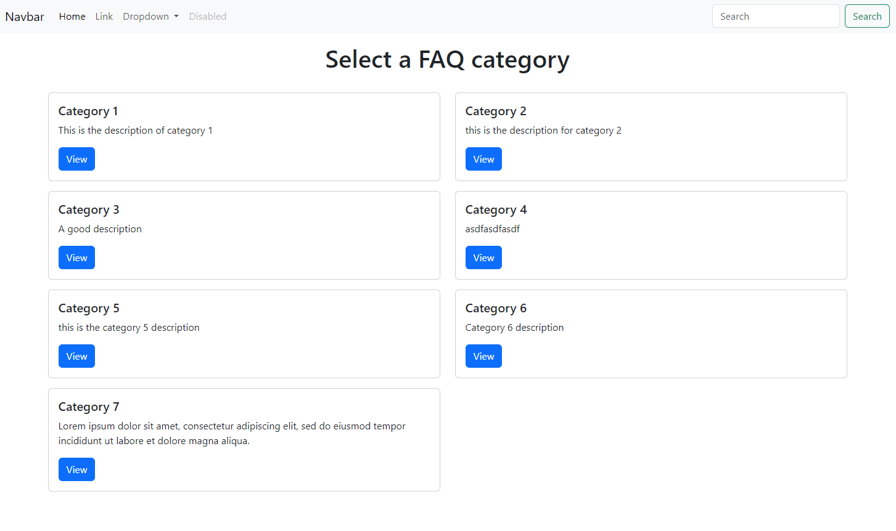
/faq/category-1/
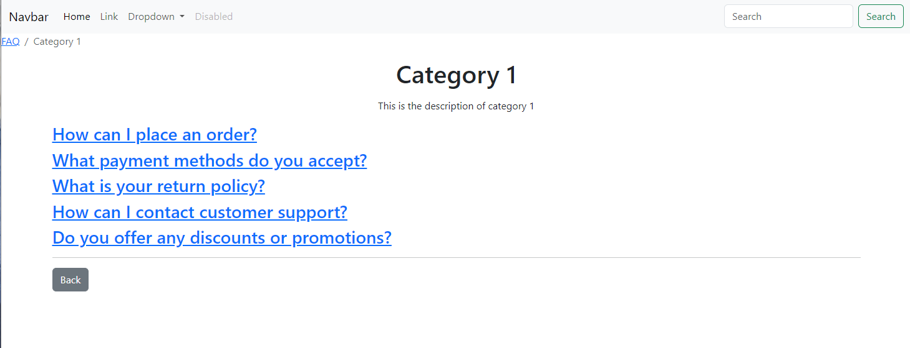
/faq/category-1/do-you-offer-any-discounts-or-promotions/

with an answer
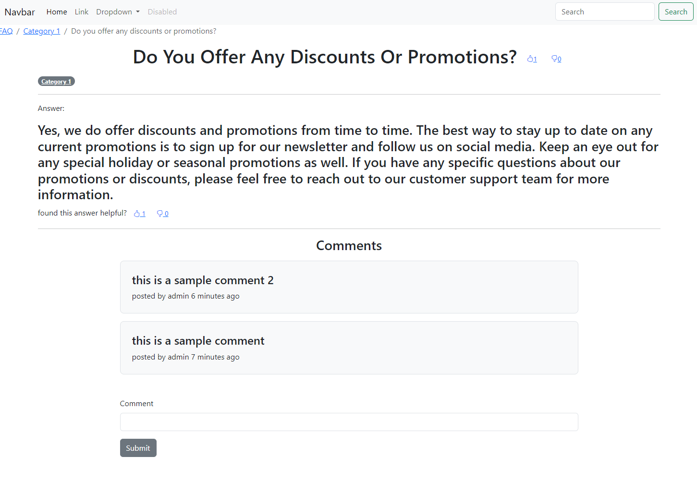
### no_category_description

Categories don't have category descriptions.

/faq/
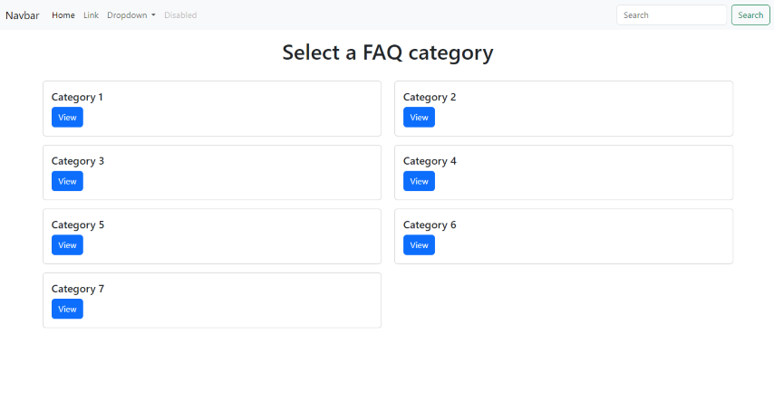

/faq/category-1/
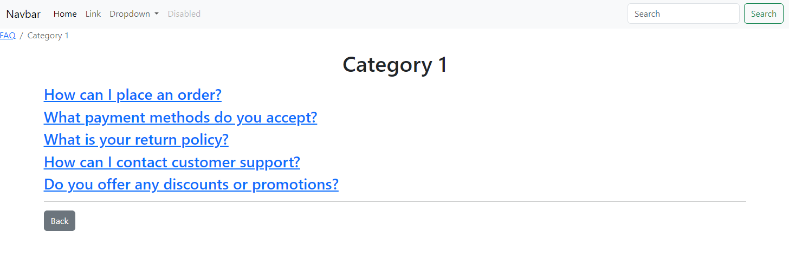
### no_category

there are no categories for questions. All questions show on the faq index page

/faq/
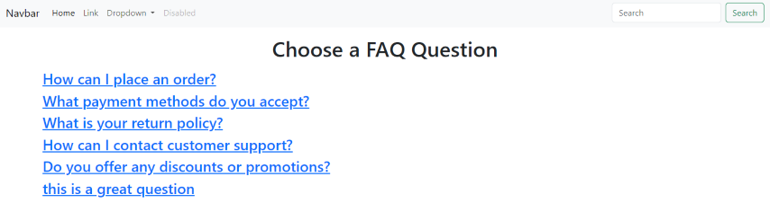

/faq/do-you-offer-any-discounts-or-promotions/
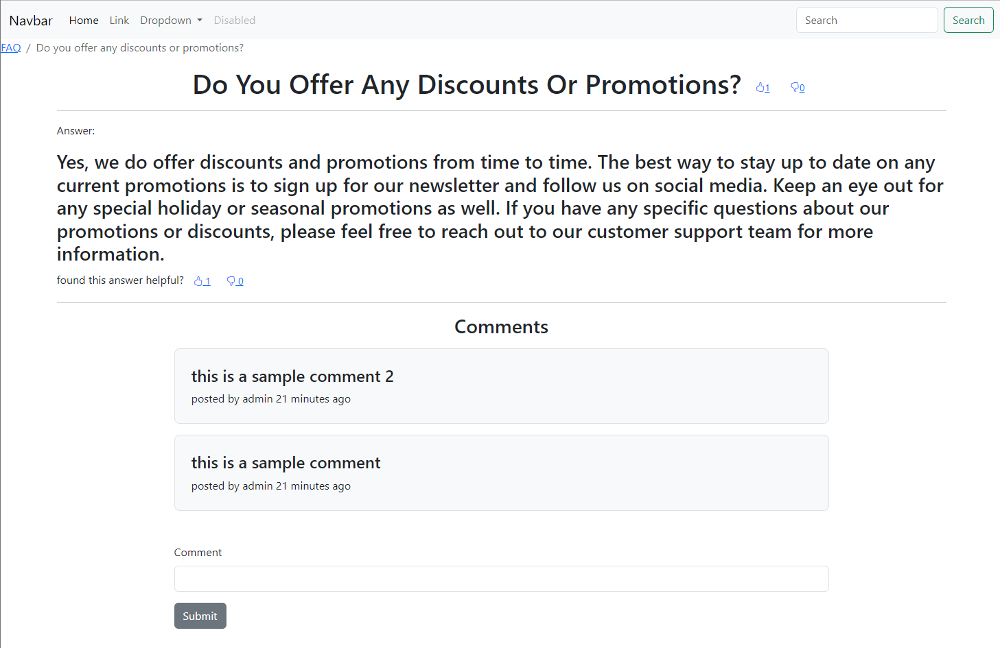

### logged_in_users_can_add_question

allow logged in users to ask questions

/faq/category-1/
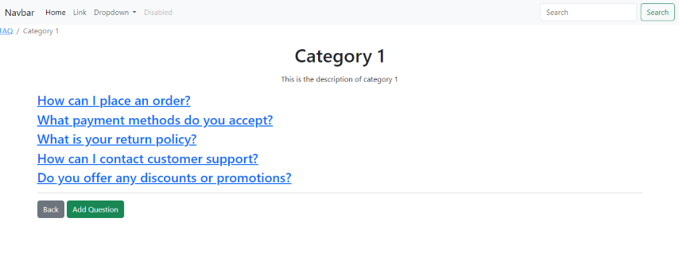

/faq/category-1/add/question/
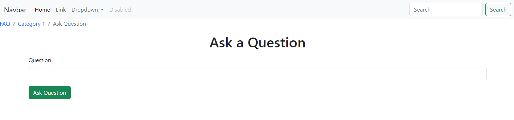

### logged_in_users_can_answer_question

allow users that are logged in to be able to answer the questions

/faq/category-1/what-payment-methods-do-you-accept/
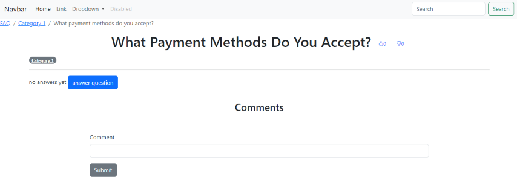

/faq/category-1/what-payment-methods-do-you-accept/answer/
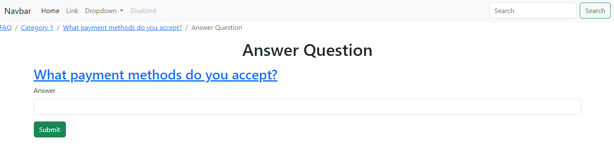

### allow_multiple_answers

More than one answer can exist for the question. If `logged_in_users_can_answer_question` is also set then users can add their own answers to the question.

/faq/category-1/what-is-your-return-policy/
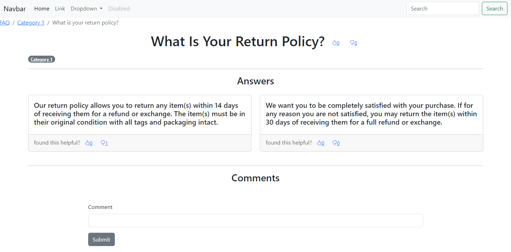

### no_comments

showing or adding comments to questions is removed

/faq/category-1/do-you-offer-any-discounts-or-promotions/

### anonymous_user_can_comment

even users that are not logged in can comment

/faq/category-1/do-you-offer-any-discounts-or-promotions/

### view_only_comments

users can only view the comments

/faq/category-1/do-you-offer-any-discounts-or-promotions/
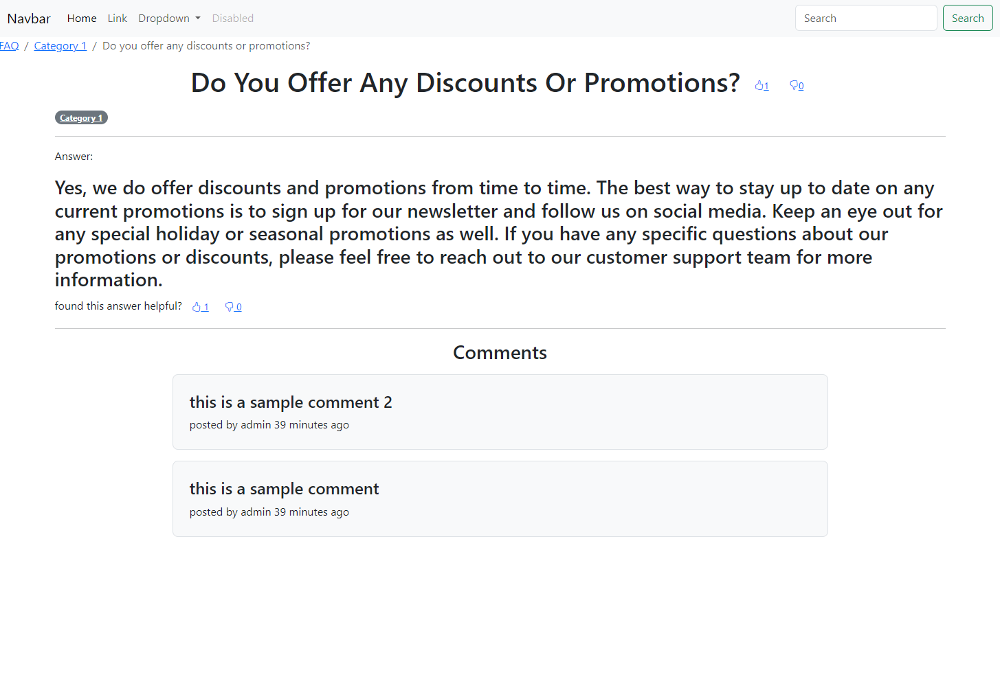

### no_votes

users cannot vote on questions or answers

/faq/category-1/do-you-offer-any-discounts-or-promotions/
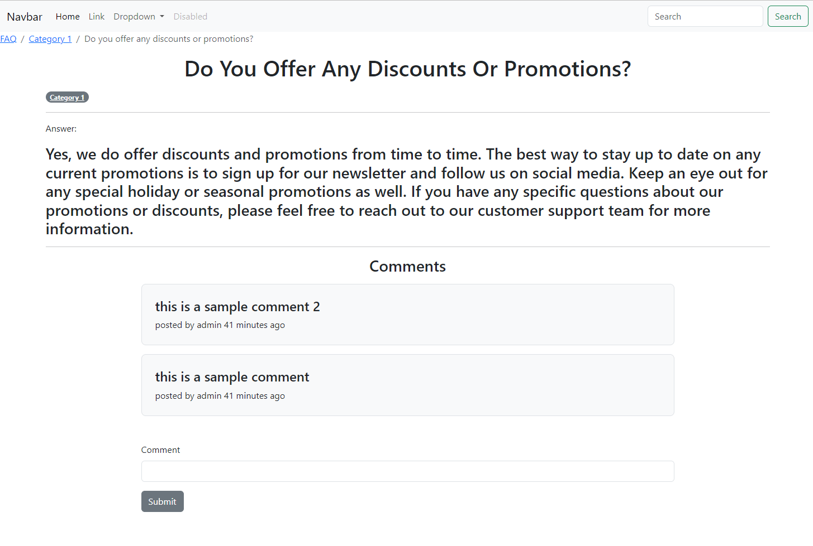

### no_answer_votes

can only vote on questions

/faq/category-1/do-you-offer-any-discounts-or-promotions/
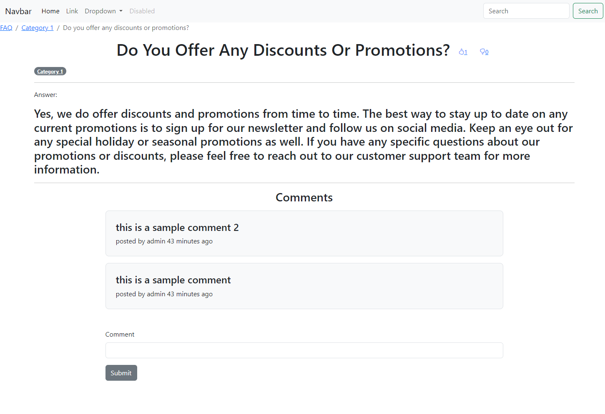

### no_question_votes

can only vote on answers

/faq/category-1/do-you-offer-any-discounts-or-promotions/
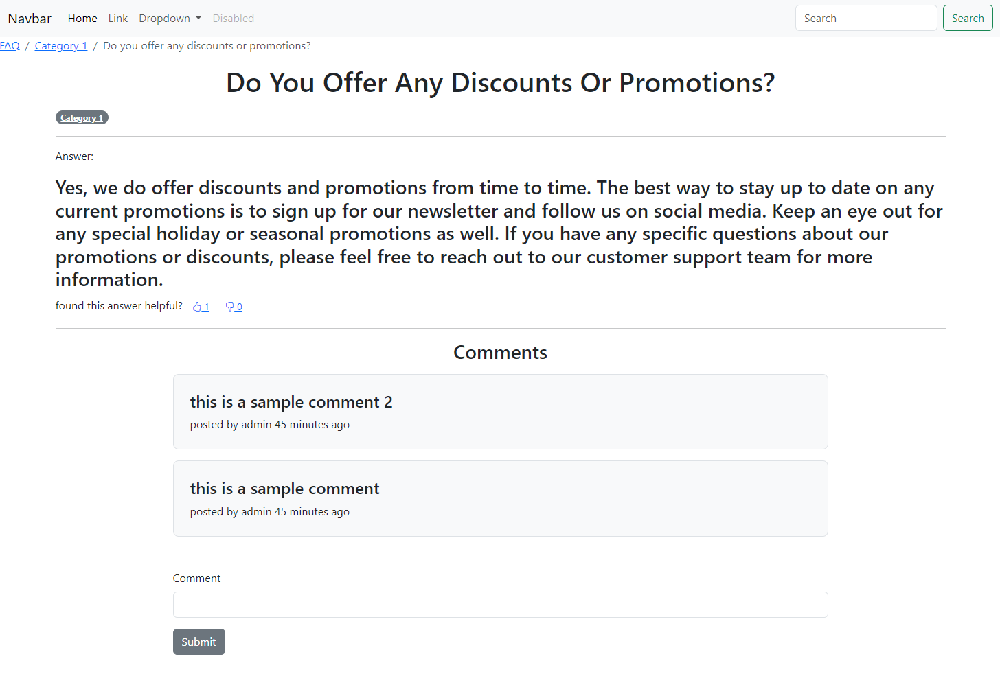
